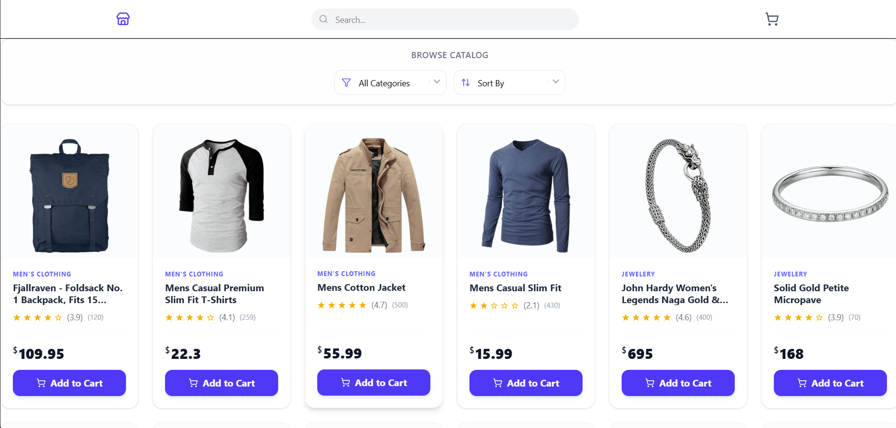
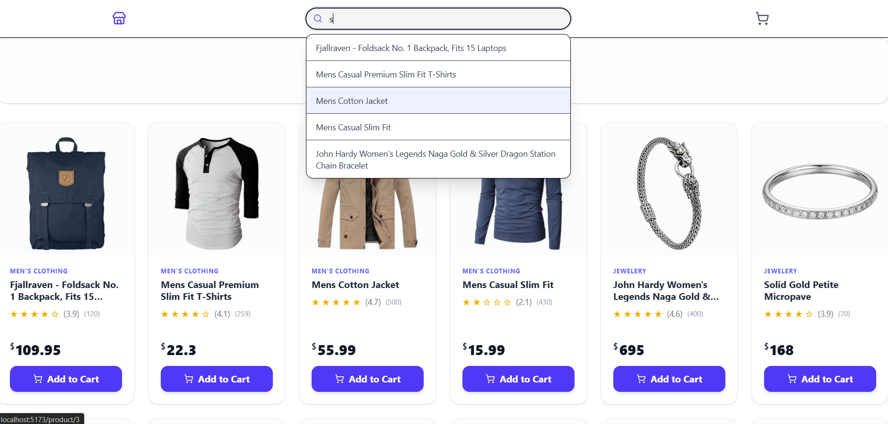
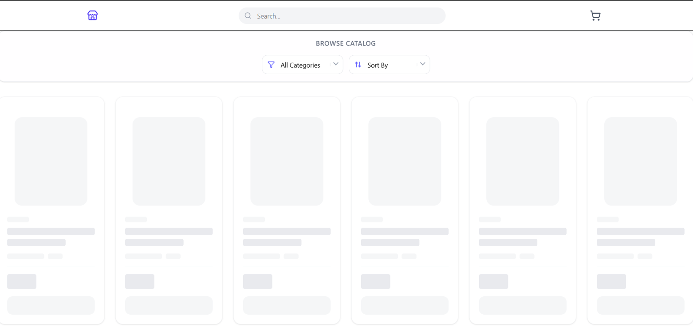
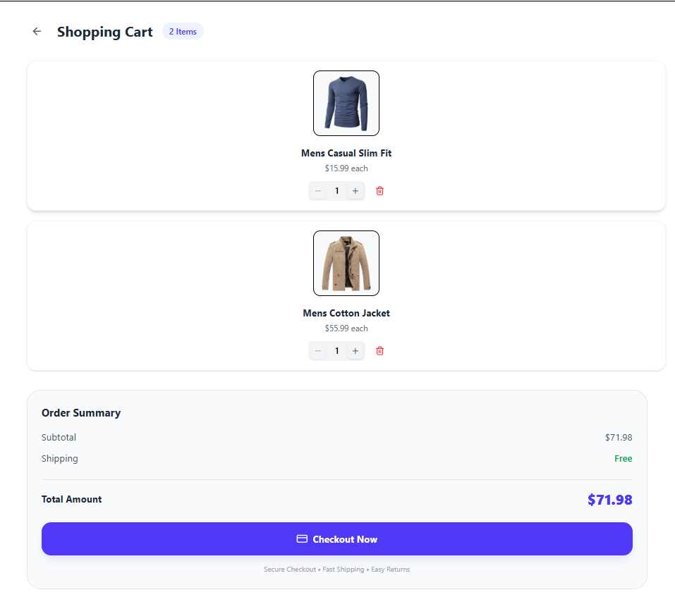
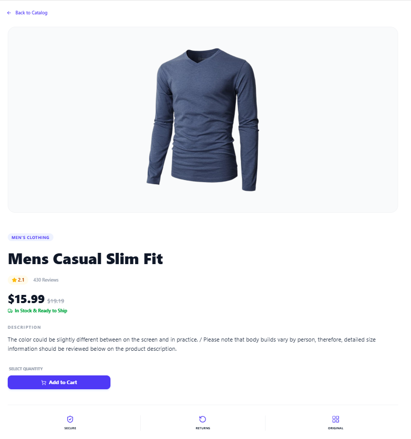
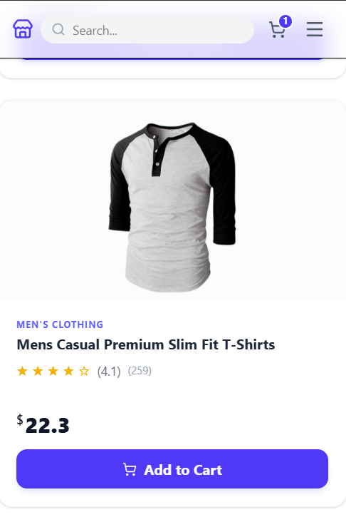
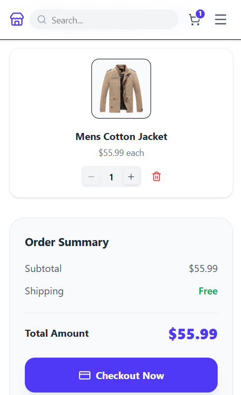

# StoreFront

A modern eCommerce frontend built with React and TailwindCSS.
This project focuses on modern UX patterns such as skeleton loading,
autocomplete search, responsive product grids, and persistent cart state using localStorage web API.

## Features

- Product search with live suggestions
- Category filtering and sorting
- Shopping cart with quantity controls
- Persistent cart
- Skeleton loading for smooth UX
- Responsive layout for mobile and desktop
- Product recommendation sections

## Tech Stack

- React
- TailwindCSS
- React Router
- Context API
- FakeStore API

## Live Demo

https://my-frontstore.netlify.app/

## Screenshots

(Add screenshots here)







## Installation

```bash
git clone https://github.com/rogerskibet/Storefront
cd Storefront
npm install
npm run dev